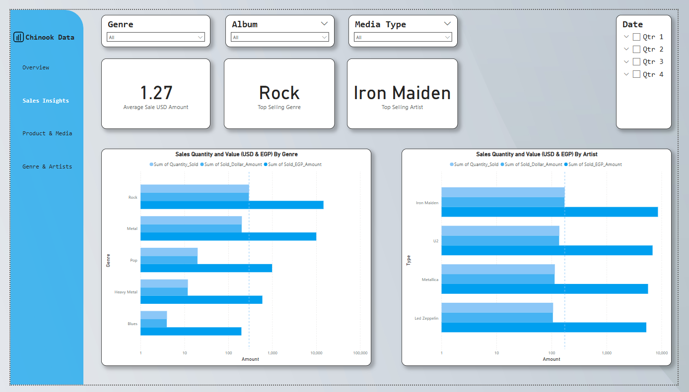

# Chinook Music Analytics Dashboard

## Overview

The Chinook Music Analytics Dashboard provides comprehensive visualization and analysis tools for a digital music store's sales and performance data. Built on a data warehouse leveraging the Chinook database, this dashboard delivers actionable insights on music sales, artist performance, genre popularity, and media format preferences across both desktop and mobile interfaces.


## Features

### Responsive Design
- **Desktop View**: Optimized for data analysis workstations with expanded visualization options
- **Mobile View**: Streamlined interface for on-the-go access to key performance metrics

### Dashboard Pages

1. **Overview**
   - Executive summary of key performance indicators
   - Sales trends over time
   - At-a-glance comparison of revenue streams

2. **Sales & Insights**
   - Detailed breakdown of sales by time period
   - Revenue tracking in multiple currencies (USD and EGP)
   - Sales quantity analysis

3. **Product & Media**
   - Media type popularity visualization
   - Revenue comparison across different formats
   - Product performance metrics

4. **Genre & Artists**
   - Top selling genres with trend analysis
   - Leading artist performance tracking
   - Genre/artist correlation insights

## Screenshots

### Desktop Pages




### Mobile Pages


## Technology Stack

- **Data Warehouse**: SQL Server Analysis Services (SSAS)
- **ETL Pipeline**: SQL Server Integration Services (SSIS)
- **Visualization**: Power BI
- **Data Source**: Chinook Database (Music Store Data Model)

## Key Business Metrics

The dashboard focuses on six primary business goals:

1. **Total Sales Amount** - Track revenue in multiple currencies
2. **Total Quantity Sold** - Monitor sales volume and trends
3. **Top Selling Genres** - Identify most popular music categories
4. **Top Selling Artists** - Highlight best-performing artists
5. **Most Popular Media Formats** - Analyze preferred content delivery methods
6. **Revenue by Media Type** - Compare profitability across formats

## Installation & Access

### Prerequisites
- Power BI Desktop (for local development)
- Access to the Chinook data warehouse

### Setup Instructions
1. Clone this repository
2. Connect to the Chinook data warehouse
3. Open the `.pbix` file in Power BI Desktop

## Project Structure

```
chinook-dashboard/
├── data/
│   ├── chinook_dw_schema.sql
│   └── sample_data/
├── etl/
│   ├── ssis_packages/
│   └── dimension_scripts/
├── dashboard/
│   ├── chinook_dashboard.pbix
│   ├── mobile_layout/
│   └── desktop_layout/
└── README.md
```

## Team

  - [@RamzyBakir](https://github.com/RamzyBakir)
  - [@YahiaSonbol](https://github.com/YahiaSonbol)
  - [@youssefAhmed](https://github.com/youssefahmed24)
  - [@YoussefHazem](https://github.com/youssefeLsharaawy)
  
## License

This project is licensed under the MIT License - see the LICENSE file for details.

---

For questions or support, please contact the team through GitHub issues or email.
